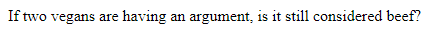
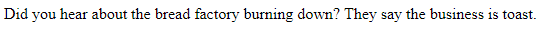

# API Intro

## Description
On page load, a random dad joke is printed to the dom. This was an in-class exercise following a brief introductory lecture on API's.

## Snapshots



## Acknowledgements
This app uses the [icanhazdadjoke api](https://icanhazdadjoke.com/api).

## How to view a dad joke
* Clone this repository to your local machine.
* Use npm to install http-server in your terminal:
```sh
npm install -g http-server
```
* Run the server in your terminal
```sh
hs -p 9999
```
* Open chrome and navigate to:
```
localhost: 9999
```
